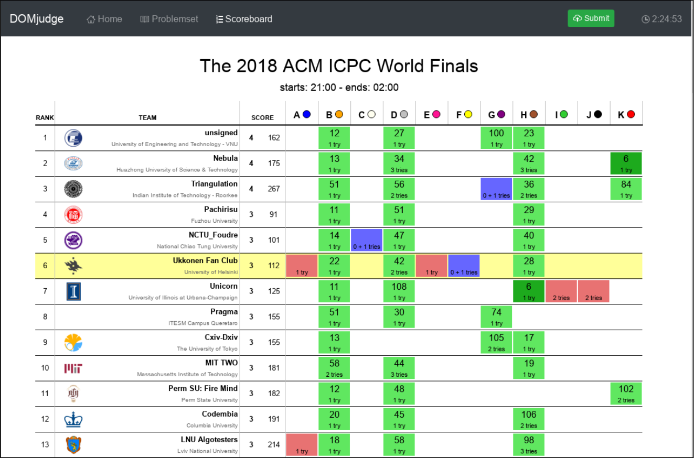

# 0 概要

本页面对评测系统界面作出了简短的概述。通过了解概要中简单的介绍，即可开始使用本系统。但我们仍强烈建议参赛队伍完整地阅读此文档。当您遇到问题时，文档中有关于本比赛控制系统一些重要的细节信息可供参考，**请务必注意！**

基于网页界面的 DOMjudge 可通过访问 [https://example.com/domjudge/team](https://example.com/domjudge/team)  浏览。您也可以通过下页中的 图1/图2 大致了解DOMjudge的界面。

## 程序读写

提交的程序应全部从 “标准输入流” 中读取输入数据， 并将输出全部输出至 “标准输出流”（即控制台）。您不必打开（其他）文件。附录A中有一些样例代码可供参考。

## 提交您的题解

您可以通过命令行中 ```submit``` 命令或通过网页界面提交答案：

  * ### 通过命令行提交
    使用 ```submit <filename(文件名)>``` 命令。如果您的文件名是类似 ```<filename(文件名)>.<extension(扩展名)>```的形式， 且文件名对应了题目的标签，扩展名是所使用编程语言的标准扩展名，则程序会自动识别您的提交。程序也会自动检测 ```Java``` 和 ```Kotlin``` 的 ```main class```，以及 ```Python 2``` 和 ```Python 3``` 的 ```main file```。您也可以强制关闭自动检测功能。若想了解完整功能，请使用 ```submit --help ```。
  * ### 通过网页界面提交
    在您队伍的页面中[https://example.com/domjudge/team](https://example.com/domjudge/team)，点击菜单栏上绿色的 ```Submit``` 按钮。选择要提交的文件。默认情况下，会自动选中与您提交文件名相同标签的题目，并根据扩展名自动选择对应语言。网页同时也会根据文件名自动检测```Java``` 和 ```Kotlin``` 的 ```main class```，以及 ```Python 2``` 和 ```Python 3``` 的 ```main file```。提交前请再次检查自动检测是否正确。

## 查看您的分数、提交情况

可以通过网页界面 [https://example.com/domjudge/team](https://example.com/domjudge/team) 直接实现查看队伍的分数、提交情况、解释请求以及对请求的答复。

---
Figure 1: 网页队伍总览界面


Figure 2: 榜单界面


---

*以上*
